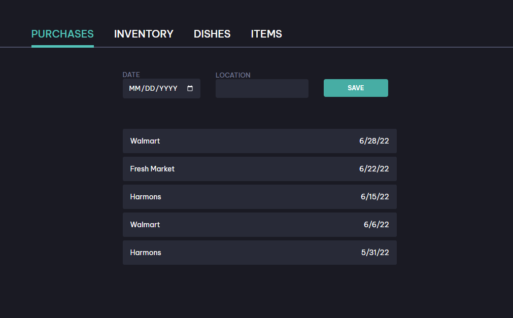
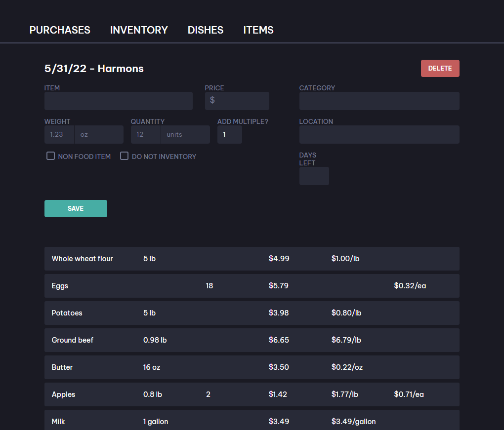
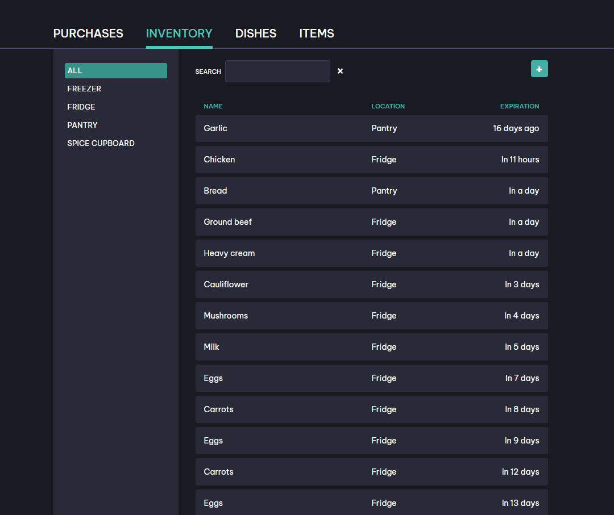
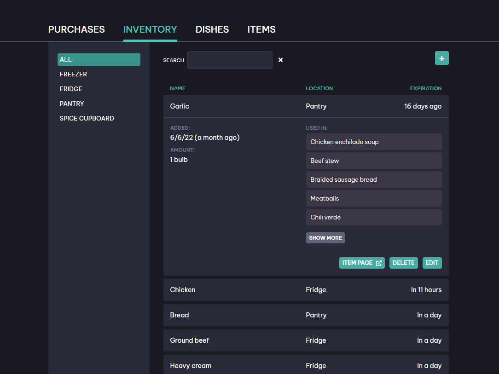
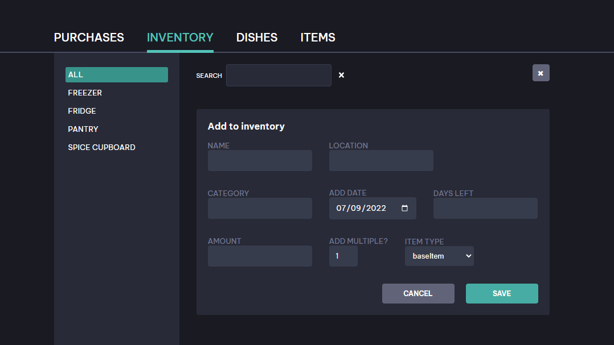
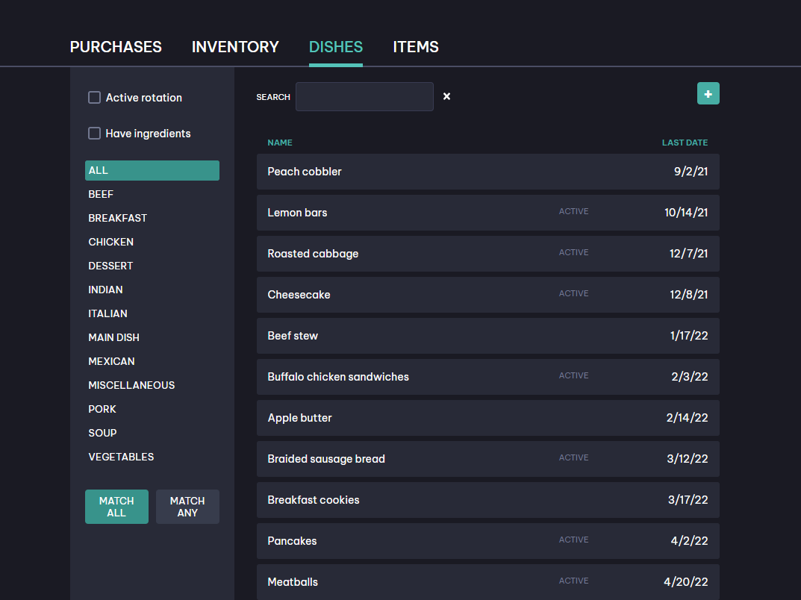

An app for tracking your groceries, the food in your fridge, and the meals you can make with it.

Built using PostgreSQL, Go, GraphQL, Apollo Client, React.

The frontend is deployed to Netlify, and the backend to Heroku.

[Backend repository](https://github.com/laurakcleve/go-meal)

# Overview

## Purchases

Add an entry for the date and location of each grocery trip.

Enter the details of each item you bought. Items added to your purchase are automatically added to your inventory.

The item's category, location, and shelflife are all remembered and filled in when you enter its name.

## Inventory

The inventory is sorted by expiration by default, and can be sorted and filtered by the current location of each item.

When you need to use up an ingredient ASAP, you can see all the dishes it's used in.

You can still add items to the inventory without having purchased them, usually used for dishes you've made.

## Dishes

You can think of dishes as recipes, but they don't all have to have ingredients; they can be any meal or part of a meal that you want to keep track of.

Your list of dishes can be sorted by the last time you used each of them, so you can see things you haven't had for a while, and keep a rotation going if you like. You can also set any dish to active/inactive, so as you plan your meals you can filter out anything you don't want to be eating regularly.

A dish's details will list all of its ingredients, with anything you don't currently have in your inventory greyed out.

## Items

The Items page is a master list of every item that has ever been added to a purchase, a dish, or the inventory.

The item page will show details about each item, including the average price you have paid for it, overall and by location.

